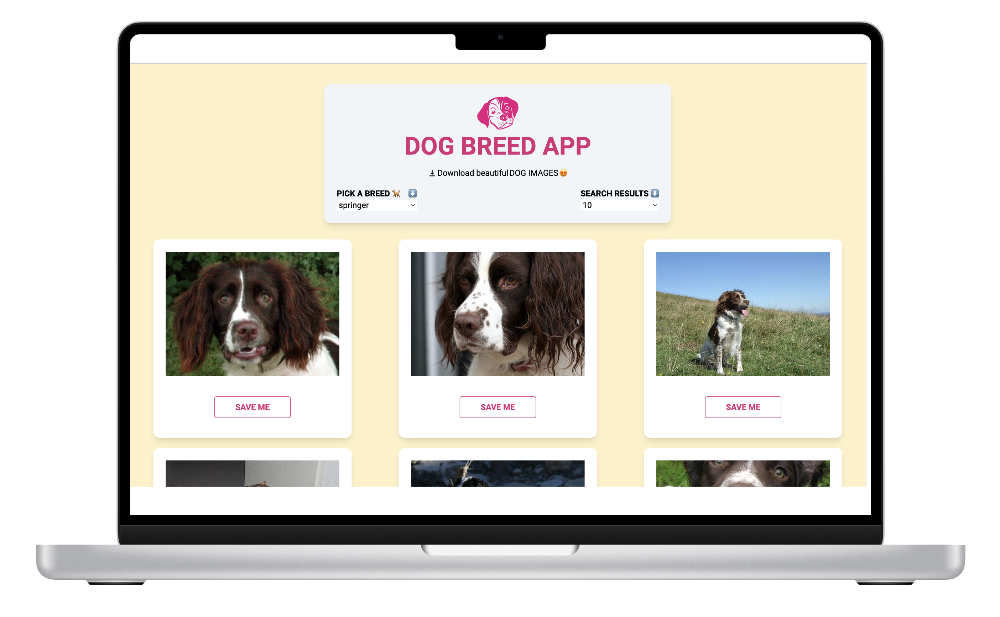
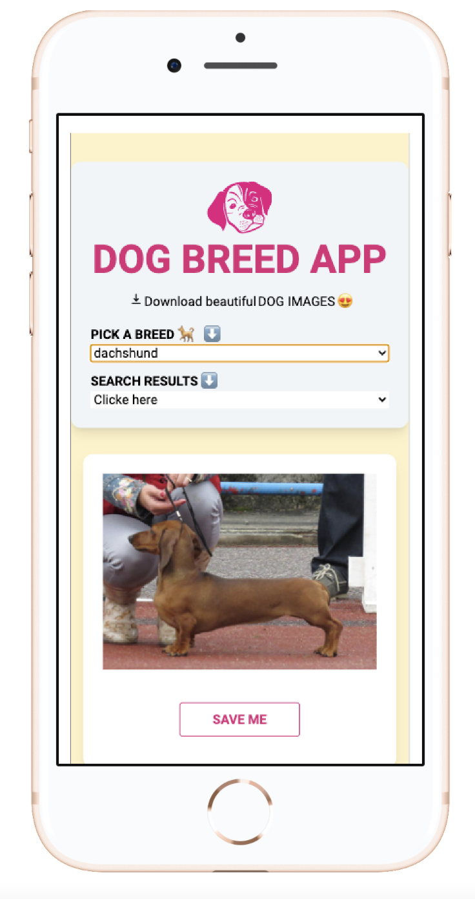

# DOG BREED APP

## Preview of the Project




## Project setup

```
npm install
npm run serve
npm run build
```

### Technologies used

1. Vuejs 2
2. Javascript
3. HTML
4. TailwindCSS
5. NodeJs

### Features

1. Download Dog Images from an API
2. Filter Results

#### Improvements

1. Error Handling
2. State Management
3. Transition

### Special Thanks for the Challenge

@https://streamdiver.com/
